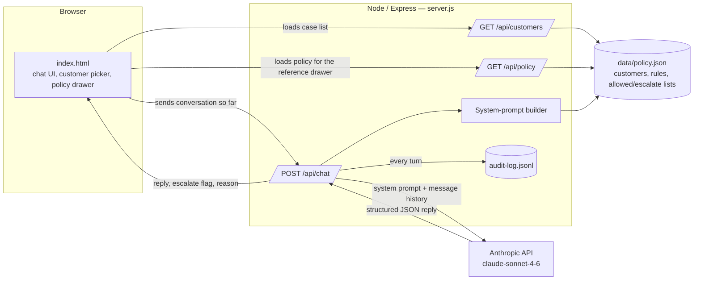

# Resolution Desk — Customer-Facing Resolution Agent

**AIONOS Agentic AI Factory — Assignment 3 (Customer-Facing Resolution Agent)**
Scenario: airline disruption support for SkyKarnata Air, exercise date Wednesday 23 September 2026.

A working agent that handles an airline customer's disruption end to end: understands intent, applies only the supplied policy data, recommends or executes the correct next action, handles an angry or confused customer, escalates when it lacks authority, and keeps a clear record of every turn.

---

## 1. What it does

Three real cases from the data pack are loaded on the left. Selecting one opens the customer's actual first message and the agent replies live, applying the rules itself rather than following a scripted path:

| Customer | Situation | What the agent should get right |
|---|---|---|
| Priya Nair (Gold) | SK-204 Delhi→Goa cancelled | Offers rebook-or-refund choice; when she also demands a cash refund *and* a free business-class upgrade "for the trouble," it declines the extra compensation and escalates instead of granting it |
| Arvind Kulkarni (Silver) | SK-118 delayed 4h | Applies meal voucher + lounge access (3–5h band); when he asks for a hotel, explains the 5h threshold isn't met rather than granting it |
| Meher Kaur (Platinum) | SK-305 delayed 6h | Applies hotel for the delayed-hours portion only (not a full night); the ₹2,000 fare-difference request exceeds the ₹1,500 waiver limit, so that part gets escalated |

Every reply is generated live by the model reasoning over the policy text and doing the delay-hour math itself — nothing is hardcoded per scenario.

---

## 2. Architecture



**Why this shape:**
- **Data lives in one place** (`data/policy.json`). The server is the only thing that reads it and builds the system prompt — the browser never sees policy internals it doesn't need, and there's exactly one place to update if the policy changes.
- **The API key never reaches the browser.** The first version of this prototype called the Anthropic API directly from the page, which is fine for a private demo but unsafe for anything hosted or shared. Moving the call server-side is what makes this an actual submittable, runnable project rather than a chat-only artifact.
- **Every turn is written to `data/audit-log.jsonl`** — timestamp, customer, the customer's message, the agent's reply, and whether it escalated. That's the conversation-and-action record the brief asks for; `GET /api/audit-log` returns it as JSON if you want to inspect or export it.
- **The model is asked to return structured JSON** (`{reply, escalate, reason}`) rather than free text, so escalation is a explicit signal the UI (or any downstream ticketing system) can act on, not something inferred from wording.

### Process flow (per customer turn)

1. Customer message arrives at `/api/chat` with the running conversation history.
2. Server looks up that customer's profile and booking record from `policy.json`.
3. Server builds a system prompt containing: the customer's own data only, the five service rules, the allowed-actions list, the must-escalate list, and three tone-reference snippets (explicitly marked as tone-only, not fact, matching the data pack's instruction).
4. Server calls Claude (`claude-sonnet-4-6`) with that system prompt and the message history, asking for a single JSON object back.
5. Server parses the JSON, logs the turn, and returns `{reply, escalate, reason}` to the browser.
6. Browser renders the reply as a chat bubble, and — if `escalate` is true — a visible escalation banner with the reason, matching the brief's "escalate when authority is missing" requirement.

---

## 3. Inputs, sources, and assumptions

**Source of truth:** everything in `data/policy.json` is copied directly from the assignment data pack — customer profiles, booking/transaction data, the five service rules, and the allowed/prohibited action lists. Nothing outside that file is treated as fact by the agent; the system prompt explicitly tells the model not to invent policy.

**Assumptions made where the data pack was silent:**
- The exercise date (Wed 23 Sep 2026) is fixed as "today" for all delay/cancellation math, since the data pack states this is when the exercise is set.
- There's no real booking or payments system behind this — rebooking, refunds, vouchers, and hotel arrangement are represented as the agent *stating* the action it's taking, not an actual downstream transaction (no such system was supplied in the data pack).
- The three "sample prior conversations" in the data pack are used only as a tone reference, exactly as the data pack instructs — they are never treated as policy or fact for Priya, Arvind, or Meher's cases.
- Contact details (email/phone) are stored but not surfaced in the UI, since no requirement in the brief calls for displaying them and they're partially masked in the source data.
- Currency is INR (₹) throughout, per the data pack.

---

## 4. AI tools used, and how

- **Claude (Anthropic, this conversation)** — used for the full build: reading and structuring the data pack, designing the architecture (client/server split, why the key needed to move server-side), writing the Express backend, the frontend, the system-prompt template, and this documentation. Also used to reason through each of the three scenarios by hand to sanity-check what a compliant answer should look like before wiring up the live agent.
- **Claude Sonnet 4.6 (`claude-sonnet-4-6`), via the Anthropic Messages API** — this is the actual runtime reasoning engine. At request time it receives the grounded system prompt (customer data + policy only) and produces the customer-facing reply and the escalation decision. No other model or rules engine makes the policy decisions — they come from the model reasoning over the supplied policy text, not from hardcoded per-scenario logic.

---

## 5. Running it

Requires Node.js 18+ (for native `fetch`) and an Anthropic API key.

```bash
cd resolution-agent
npm install
cp .env.example .env
# edit .env and set ANTHROPIC_API_KEY=sk-ant-...
npm start
```

Open **http://localhost:3000**, pick a customer on the left, and the conversation starts automatically with their real opening message. Use the suggested reply chip to test the tricky ask in each scenario, or type your own follow-up.

- `GET /api/audit-log` — view the full conversation-and-action log as JSON.
- `data/policy.json` — the single file to edit if the policy or customer data changes.

---

## 6. What's not included here

Per the assignment's mandatory outputs, the following are produced separately alongside this repo, not inside it:
- 15-minute live demo and defence (scheduled after submission).
- Demo video, uploaded to Drive with open access.
- 10-slide PPT summarising this project (see `/deck` if bundled with this submission, or the separate file provided).
- This GitHub repository itself — push this folder to a new repo and link it in the submission form.
